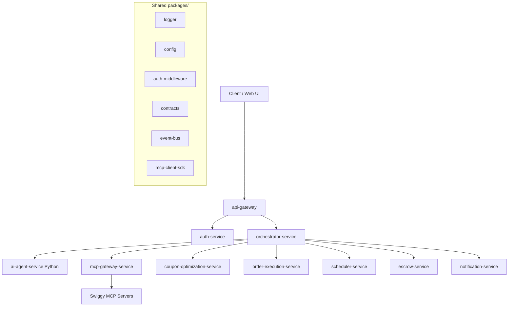

# Gusto Backend Code Structure & Developer Documentation

Welcome to the Gusto backend developer documentation. Gusto is a high-autonomy agentic food-ordering platform built on top of Swiggy's Model Context Protocol (MCP) servers. The backend is designed as a modular monorepo using **pnpm** and **Turborepo** to manage multiple independent microservices and shared libraries.

---

## 1. Architecture Overview

Gusto is structured as a **microservices monorepo** to achieve clear separation of concerns, enforce security/isolation boundaries (especially for LLM access and payment authority), and allow independent scalability.



### Critical Architecture Boundaries

1. **AI Reasoning Boundary**: [ai-agent-service](file:///c:/gusto_backend/apps/ai-agent-service) is the **only** service allowed to talk to the LLM (Large Language Model). It is a stateless Python service with no database, no direct access to Swiggy MCP, and no payment authority. It is called exclusively by [orchestrator-service](file:///c:/gusto_backend/apps/orchestrator-service).
2. **MCP Gateway Boundary**: [mcp-gateway-service](file:///c:/gusto_backend/apps/mcp-gateway-service) is the **only** service allowed to hold credentials and invoke Swiggy's MCP servers. Other services must interact with Swiggy through this gateway using the shared [mcp-client-sdk](file:///c:/gusto_backend/packages/mcp-client-sdk).
3. **Database Schema Isolation**: Each stateful service owns its own dedicated database schema inside PostgreSQL (rather than a shared database). Each has its own `prisma/schema.prisma` file, migrations folder, and generates its own isolated Prisma Client.

---

## 2. Directory Structure

```
c:\gusto_backend
├── apps/                        # Deployable applications & microservices
│   ├── ai-agent-service/        # Python/FastAPI service for AI reasoning (stateless)
│   ├── api-gateway/             # Public-facing NestJS entry point, routes requests, checks auth
│   ├── auth-service/            # Handles OAuth2.1+PKCE, JWTs, and encrypted MCP credentials
│   ├── coupon-optimization-service/ # Deterministic "Hacker" cart-optimization logic (stateless)
│   ├── escrow-service/          # Wallet, 30-day budget rollover, and savings ledger
│   ├── mcp-gateway-service/     # Invokes Swiggy MCP servers, caches responses via Redis
│   ├── mock-swiggy-service/     # Docs-faithful mock Swiggy Food MCP server (local/CI testing only)
│   ├── notification-service/    # Outbound push notifications, SMS, email, and user decisions
│   ├── orchestrator-service/    # Core state machine managing daily & 30-day workflows
│   ├── order-execution-service/ # Final cart building, human-in-the-loop triggers, placement
│   └── scheduler-service/       # Cron triggers for cohort-staggered daily processes
│
├── packages/                    # Shared packages (published locally via pnpm workspaces)
│   ├── auth-middleware/         # Shared JWT verification and roles checking
│   ├── config/                  # Core Zod env schema and configuration utilities
│   ├── contracts/               # Shared event schemas and DTOs
│   ├── eslint-config/           # Shared ESLint rule presets
│   ├── event-bus/               # Event publishing and subscription abstraction (AWS SQS/EventBridge)
│   ├── logger/                  # Unified JSON logging format using Pino
│   ├── mcp-client-sdk/          # Typed client used by services to communicate with mcp-gateway
│   └── tsconfig/                # Shared base TypeScript configurations
│
├── infra/                       # Infrastructure-as-code and local environment tooling
│   ├── docker/                  # Local docker-compose configuration (PostgreSQL, Redis, LocalStack)
│   └── terraform/               # Production cloud provisioning configurations
│
├── scripts/                     # Utility scripts for bootstrapping and workspace management
├── package.json                 # Monorepo configuration
├── pnpm-workspace.yaml          # Defines monorepo workspace roots
├── tsconfig.base.json           # Global base TypeScript configurations
└── turbo.json                   # Turborepo task pipeline definition
```

---

## 3. Microservice Specifications (`apps/`)

All Node.js services are built with **NestJS** and use **TypeScript** unless specified otherwise.

| Service | Runtime / Framework | Persistence / DB Schema | Key Responsibility |
| :--- | :--- | :--- | :--- |
| **api-gateway** | Node.js / NestJS | None | Authentication check, rate limiting, and HTTP routing. |
| **auth-service** | Node.js / NestJS | PostgreSQL (`auth`) | User accounts, token encryption, and OAuth integration with Swiggy. |
| **orchestrator-service** | Node.js / NestJS | PostgreSQL (`orchestrator`) | Workflow state management. Decides when to invoke `ai-agent-service`. |
| **coupon-optimization-service** | Node.js / NestJS | None | Executes the deterministic savings and cart calculation. |
| **order-execution-service** | Node.js / NestJS | PostgreSQL (`order_execution`) | Builds final carts, requests user checkout approval, places orders. |
| **escrow-service** | Node.js / NestJS | PostgreSQL (`escrow`) | Holds user funds, records credits, rollovers, and balances. |
| **scheduler-service** | Node.js / NestJS | PostgreSQL (`scheduler`) | Handles cron triggers to wake up orchestrator cohorts. |
| **notification-service** | Node.js / NestJS | PostgreSQL (`notification`) | Sends notifications and collects user interactive decisions. |
| **mcp-gateway-service** | Node.js / NestJS | Redis (Cache) | Sole communicator with Swiggy API/MCP servers. |
| **ai-agent-service** | Python / FastAPI | None | Runs the Scout agent utilizing LLM prompting. |
| **mock-swiggy-service** | Node.js / Express | None | Docs-faithful stand-in for Swiggy's real Food MCP server, used for local/CI testing (not part of the production topology). See `prompting_docs/phase1-mock-swiggy-testing-results.md`. |

### Default ports

| Service | Port |
| :--- | :--- |
| api-gateway | 3000 |
| auth-service | 3001 |
| orchestrator-service | 3002 |
| coupon-optimization-service | 3003 |
| order-execution-service | 3004 |
| escrow-service | 3005 |
| scheduler-service | 3006 |
| notification-service | 3007 |
| mcp-gateway-service | 3008 |
| ai-agent-service | 8001 |
| mock-swiggy-service | 3010 |

---

## 4. Shared Packages (`packages/`)

Shared packages are declared as workspace dependencies in NestJS services (`package.json`) under the format `"@gusto/<package-name>": "workspace:*"`:

- **[logger](file:///c:/gusto_backend/packages/logger)**: Exposes a standardized Pino logger setup (`createLogger(serviceName)`).
- **[config](file:///c:/gusto_backend/packages/config)**: Defines `baseEnvSchema` via Zod. This validates essential environment parameters (`NODE_ENV`, `EVENT_BUS_ENDPOINT`, etc.) at startup, preventing configuration drift.
- **[mcp-client-sdk](file:///c:/gusto_backend/packages/mcp-client-sdk)**: Exposes `McpGatewayClient` for safe REST-based communication from backend microservices to the central MCP Gateway.
- **[event-bus](file:///c:/gusto_backend/packages/event-bus)**: Implements publisher-subscriber models over SQS and EventBridge, facilitating async decoupling of services.

---

## 5. Development and Workflow Guide

### Prerequisites
- Node.js (v20+ -- matches the `node:20-alpine` base every service's Dockerfile builds on)
- `pnpm` (v9.7.0, pinned via `packageManager` in the root `package.json`)
- Docker and Docker Compose

### Bootstrapping the Workspace
Run the bootstrapper script to install dependencies, stand up Postgres, Redis, and LocalStack, and run the database migrations:
```bash
./scripts/bootstrap.sh
```

Alternatively, run these steps manually:
```bash
# 1. Install all monorepo dependencies
pnpm install

# 2. Start local docker database, cache and mock AWS services
pnpm docker:up

# 3. Create schema tables and run migrations for all stateful services
pnpm prisma:migrate:dev
```

### Running Services Locally
Start all apps and watchers in parallel:
```bash
pnpm dev
```
Turborepo handles the execution dependency graph, logging output of all microservices concurrently.

Alternatively, `docker compose -f infra/docker/docker-compose.yml up -d --build` brings up
all 10 app services plus Postgres/Redis/LocalStack as containers in one command --
see `prompting_docs/phase3-dockerization-results.md` for what that covers. For a
complete, copy-pasteable walkthrough from a clean clone (including seeding a test
user and verifying the whole stack works), see
`prompting_docs/getting-started-from-scratch.md`.

---

## 6. Schema Migration & Database Management

Stateful services declare their database structure in a local schema file, for instance `apps/orchestrator-service/prisma/schema.prisma`. 

To generate a new database migration:
1. Modify the `schema.prisma` file in the target service.
2. Run the migration command:
   ```bash
   pnpm prisma:migrate:dev
   ```
This will automatically update the database schema and regenerate the local Prisma client.
